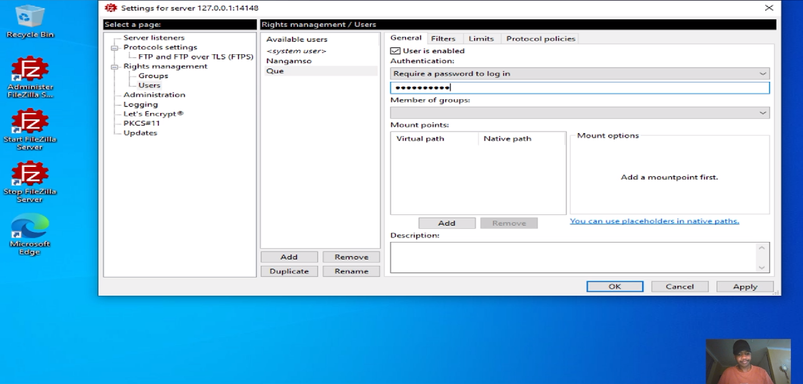
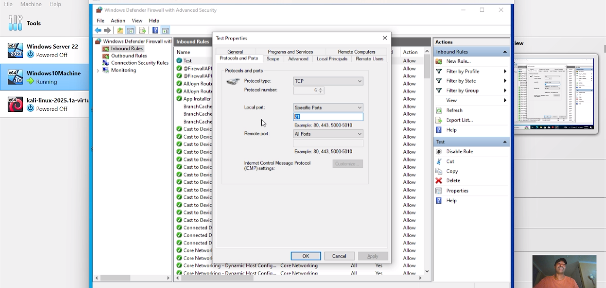
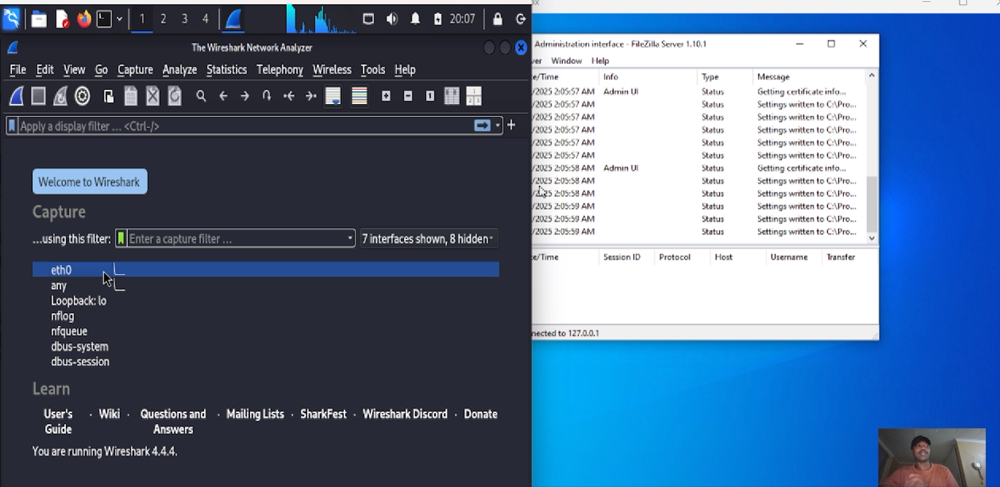
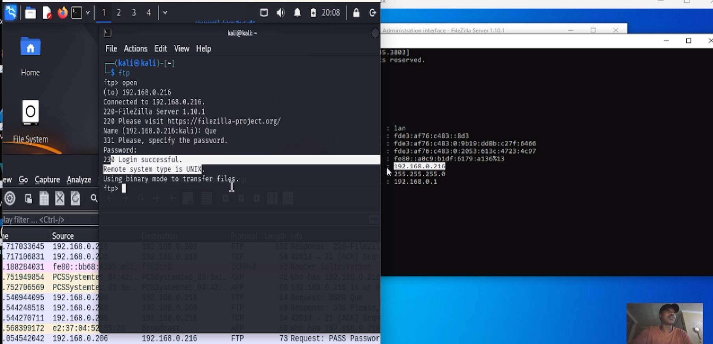
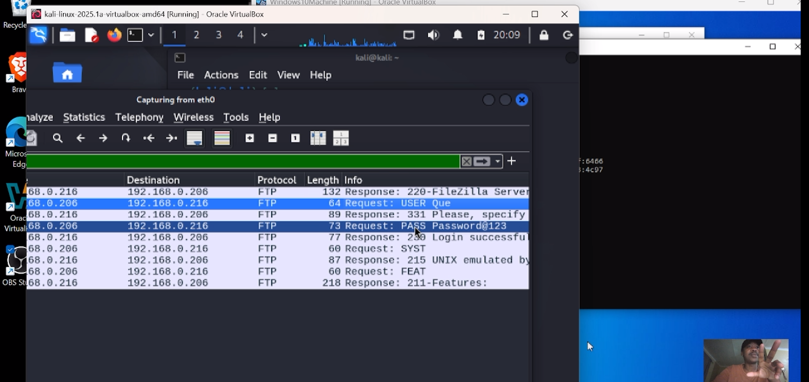

# -FTP-Wireshark-Demo
A networking lab demonstrating how FTP credentials can be sniffed using Wireshark and why secure protocols matter.

# 🧪 FTP + Wireshark Lab: Visual Walkthrough

This lab demonstrates how insecure FTP communications can expose credentials, captured using Wireshark.

---

## 1. FileZilla FTP Server Setup  
Configured FTP server with test users.

---

## 2. Allowing FTP Traffic Through Windows Firewall  
Created an inbound firewall rule to allow FTP traffic.

---

## 3. Wireshark Listening for FTP Credentials  
Launched Wireshark on Kali Linux to sniff traffic from Windows 10 VM.

---

## 4. Logging into FTP Server from Kali  
Used terminal to connect to the FTP server.

---

## 5. FTP Credentials Captured in Wireshark  
Observed login credentials in cleartext within captured packets.

---

## 🔐 Lesson
Always use secure protocols (e.g., SFTP/FTPS). This lab shows how insecure ones like FTP can leak sensitive data easily.

---

## 🎥 Demo Video  
[Watch the lab walkthrough here FTP+Wireshark 1](https://youtu.be/3RHmCYUC_QM)

[Watch the lab walkthrough here FTP+Wireshark 2](https://youtu.be/u0e0JCnHYNk)

